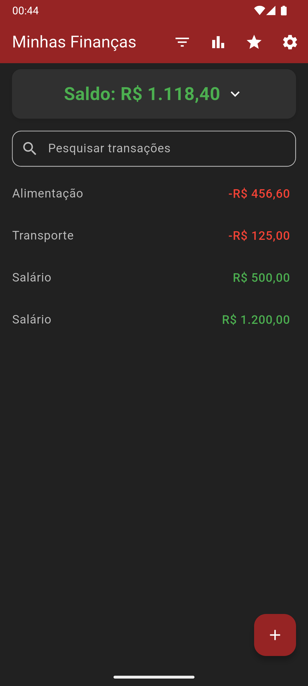
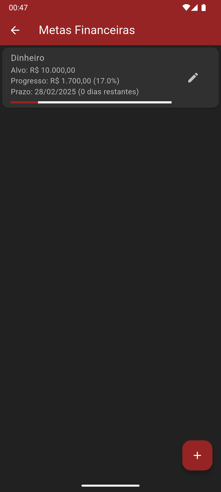
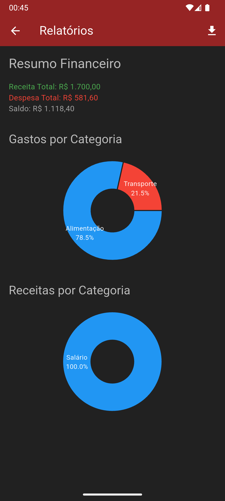

Minhas Finanças
Flutter
Minhas Finanças é um aplicativo de gerenciamento financeiro pessoal desenvolvido em Flutter, projetado para ajudar usuários a organizar suas finanças, acompanhar receitas e despesas, definir metas financeiras e visualizar relatórios detalhados. Com uma interface amigável, suporte a personalização e recursos avançados como autenticação e backups automáticos, é uma ferramenta poderosa para controle financeiro no dia a dia.
Funcionalidades
Gerenciamento de Transações:
Adição, edição e exclusão de receitas e despesas com suporte a parcelamento.

Filtros por tipo, período, categoria e pesquisa por texto.

Transações recorrentes (diárias, semanais, mensais, anuais) com notificações automáticas.

Metas Financeiras:
Criação e acompanhamento de metas com valor alvo e prazo.

Progresso visualizado com barras e integração com receitas.

Relatórios Financeiros:
Gráficos de pizza para receitas e despesas por categoria.

Exportação de relatórios em CSV ou PDF.

Personalização:
Temas predefinidos (claro, escuro, AMOLED, roxo, etc.) e personalizados com cores ajustáveis.

Suporte a moedas (BRL, USD, EUR).

Segurança:
Autenticação via PIN de 6 dígitos ou biometria (impressão digital/facial).

Gerenciamento de acesso seguro.

Gerenciamento de Categorias:
Criação, renomeação e exclusão de categorias personalizadas.

Backup e Recuperação:
Backup automático configurável (diário, semanal, mensal) para armazenamento local.

Exportação e importação manual do banco de dados.

Registro de Erros:
Visualização de logs de erros para depuração.

Capturas de Tela
| Tela Inicial | Metas Financeiras | Relatórios |
|--------------|-------------------|------------|
|  |  |  |

Como Executar o Projeto
Pré-requisitos
Flutter (versão 3.x ou superior)

Dart (versão 2.x ou superior)

Um emulador Android ou dispositivo físico

Editor recomendado: VS Code ou Android Studio

Passos para Instalação
Clone o Repositório:
bash

git clone https://github.com/seu-usuario/minhas-financas.git
cd minhas-financas

Instale as Dependências:
bash

flutter pub get

Configure o Ambiente:
Certifique-se de que um dispositivo ou emulador esteja conectado.

Para Android, configure o AndroidManifest.xml com permissões necessárias (ex.: notificações, armazenamento).

Execute o Aplicativo:
bash

flutter run

Build para Produção (opcional):
Android:
bash

flutter build apk --release

Tecnologias Utilizadas
Flutter: Framework principal para construção da UI multiplataforma.

Dart: Linguagem de programação.

SQLite: Banco de dados local via sqflite.

Provider: Gerenciamento de estado.

Dependências principais:
flutter_local_notifications: Notificações recorrentes.

local_auth: Autenticação biométrica.

fl_chart: Gráficos financeiros.

shared_preferences: Armazenamento de configurações.

flutter_background_service: Backup automático.

intl: Formatação de datas e moedas.

Veja todas as dependências no arquivo pubspec.yaml.
Estrutura do Projeto

minhas-financas/
├── lib/
│   ├── screens/            # Telas do aplicativo (UI)
│   ├── utils/              # Utilitários (helpers, serviços)
│   └── main.dart           # Ponto de entrada
├── pubspec.yaml           # Dependências e configurações
└── README.md              # Documentação

Contribuindo
Faça um fork do projeto.

Crie uma branch para sua feature:
bash

git checkout -b minha-feature

Commit suas mudanças:
bash

git commit -m "Adiciona minha feature"

Envie para o repositório remoto:
bash

git push origin minha-feature

Abra um Pull Request.

Notas
Backup no Google Drive: A funcionalidade está parcialmente implementada e requer integração adicional com APIs do Google.

Testes: Recomenda-se adicionar testes unitários e de integração para robustez.

Licença
Este projeto está licenciado sob a [Licença MIT](LICENSE.md).

Desenvolvido por Leonardo Brandão.

